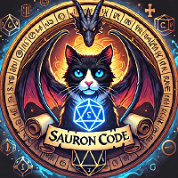

# template
A lightweight and customizable Docker setup for C++ development, including essential tools like GCC, Clang, CMake. Perfect for building and testing C++ projects in a consistent environment.

*Created by*

